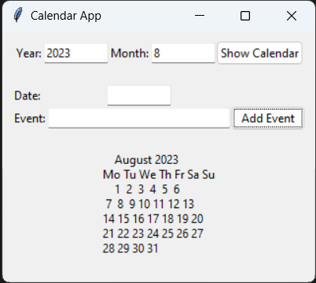

# Calendar App with GUI and Event Support

A simple Python calendar application with a graphical user interface (GUI) and event handling capabilities. This application allows users to navigate through months, add events to specific dates, and view events they've added.

## Features

- **Navigation**: Easily navigate through different months and years using the user-friendly GUI.
- **Event Management**: Add events to specific dates and keep track of your important appointments.
- **Persistence**: Events are stored in a file, allowing you to retain your event data even after closing the application.
- **User Interface**: Intuitive graphical user interface for an enhanced user experience.

## Getting Started

1. Ensure you have Python and the `tkinter` library installed on your system.
2. Clone this repository: git clone https://github.com/yourusername/calendar-app.git
3. Navigate to the project directory: cd calendar-app
4. Run the application: python calendar.py

## How to Use
Launch the application.
Use the GUI to navigate through different months and years.
To add an event, enter the date and event details in the designated fields and click "Add Event".
View the calendar to see the added events highlighted on their respective dates.

## Screenshots

## Contributions
Contributions are welcome! If you find any issues or have suggestions for improvements, feel free to submit a pull request or open an issue in this repository.

## License
This project is licensed under the MIT License.

## Acknowledgement
Special thanks to the tkinter library for providing the GUI framework, and to the Python community for their valuable contributions and support.